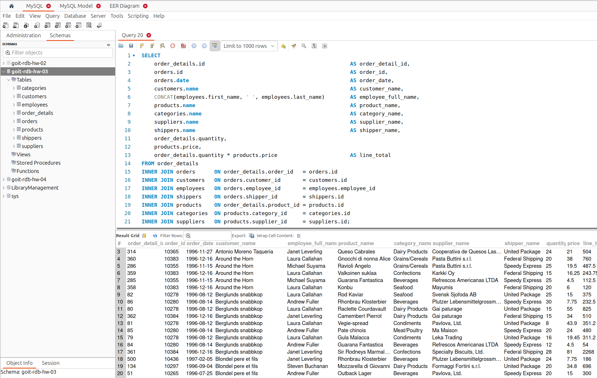
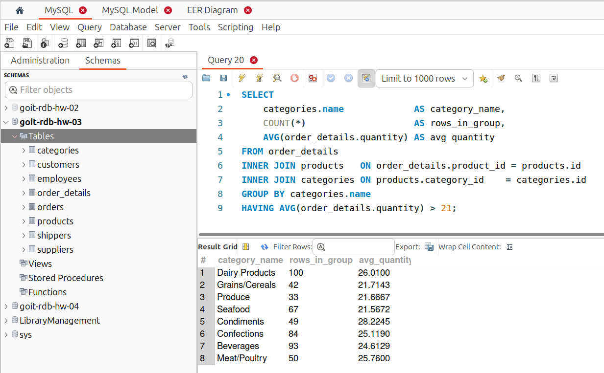
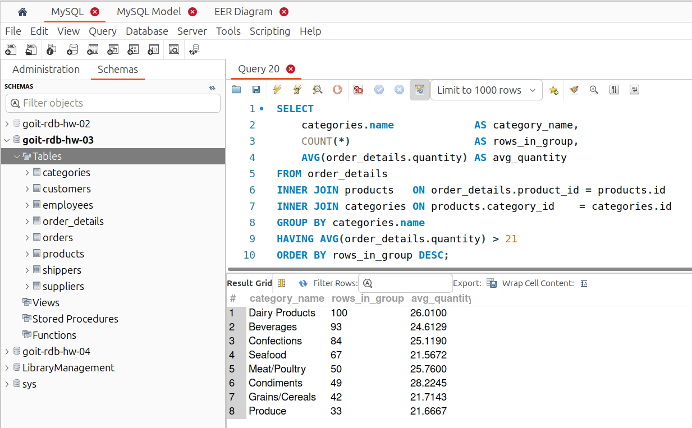

# [Домашнє завдання до Теми 4. DML та DDL команди. Складні SQL вирази](https://www.edu.goit.global/learn/25315460/21808779/22222322/homework)

## DDL (Data Definition Language) — команди визначення даних

DDL, або "Data Definition Language" (мова визначення даних) у мові SQL використовується для визначення та організації структури бази даних. DDL-команди визначають, як створювати, змінювати та видаляти об'єкти бази даних, такі як таблиці, індекси, представлення та інші.

## Опис домашнього завдання

1. Створіть базу даних для керування бібліотекою книг згідно зі структурою, наведеною нижче. Використовуйте DDL-команди для створення необхідних таблиць та їх зв'язків

    - Структура БД:

        a) Назва схеми — `LibraryManagement`

        b) Таблиця `authors`:

            author_id (INT, автоматично зростаючий PRIMARY KEY)
            author_name (VARCHAR)
        
        c) Таблиця `genres`:

            genre_id (INT, автоматично зростаючий PRIMARY KEY)
            genre_name (VARCHAR)

        d) Таблиця `books`:

            book_id (INT, автоматично зростаючий PRIMARY KEY)
            title (VARCHAR)
            publication_year (YEAR)
            author_id (INT, FOREIGN KEY зв'язок з "Authors")
            genre_id (INT, FOREIGN KEY зв'язок з "Genres")
        
        e) Таблиця `users`:

            user_id (INT, автоматично зростаючий PRIMARY KEY)
            username (VARCHAR)
            email (VARCHAR)

        f) Таблиця `borrowed_books`:

            borrow_id (INT, автоматично зростаючий PRIMARY KEY)
            book_id (INT, FOREIGN KEY зв'язок з "Books")
            user_id (INT, FOREIGN KEY зв'язок з "Users")
            borrow_date (DATE)
            return_date (DATE)

2. Заповніть таблиці простими видуманими тестовими даними. Достатньо одного-двох рядків у кожну таблицю.

3. Перейдіть до бази даних, з якою працювали у темі 3. Напишіть запит за допомогою операторів `FROM` та `INNER JOIN`, що об’єднує всі таблиці даних, які ми завантажили з файлів: `order_details`, `orders`, `customers`, `products`, `categories`, `employees`, `shippers`, `suppliers`. Для цього ви маєте знайти спільні ключі. Перевірте правильність виконання запиту.

4. Виконайте запити, перелічені нижче.

    - Визначте, скільки рядків ви отримали (за допомогою оператора `COUNT`).
    - Змініть декілька операторів `INNER` на `LEFT` чи `RIGHT`. Визначте, що відбувається з кількістю рядків. Чому? Напишіть відповідь у текстовому файлі.
    - На основі запита з пункта 3 виконайте наступне: оберіть тільки ті рядки, де `employee_id > 3` та `≤ 10`.
    - Згрупуйте за іменем категорії, порахуйте кількість рядків у групі, середню кількість товару (кількість товару знаходиться в `order_details.quantity`)
    - Відфільтруйте рядки, де середня кількість товару більша за 21.
    - Відсортуйте рядки за спаданням кількості рядків.
    - Виведіть на екран (оберіть) чотири рядки з пропущеним першим рядком.


### Критерії прийняття

1. Прикріплені посилання на репозиторій `goit-rdb-hw-04` та безпосередньо самі файли репозиторію архівом.
2. Створено базу даних з необхідною структурою.
3. Таблиці заповнено тестовими даними.
4. SQL команди до кожного пункту чи підпункту виконуються і дають очікуваний результат (створюють таблиці чи роблять певні операції з даними).
5. Дано відповіді на запитання в 4-му пункті.

## Рішення

### 1. Створіть базу даних для керування бібліотекою книг згідно зі структурою, наведеною нижче. Використовуйте DDL-команди для створення необхідних таблиць та їх зв'язків

```sql
CREATE DATABASE LibraryManagement
  DEFAULT CHARACTER SET utf8mb4
  COLLATE utf8mb4_unicode_ci;

USE LibraryManagement;

CREATE TABLE authors (
    author_id INT AUTO_INCREMENT PRIMARY KEY,
    author_name VARCHAR(255) NOT NULL
);

CREATE TABLE genres (
    genre_id INT AUTO_INCREMENT PRIMARY KEY,
    genre_name VARCHAR(100) NOT NULL
);

CREATE TABLE books (
    book_id INT AUTO_INCREMENT PRIMARY KEY,
    title VARCHAR(255) NOT NULL,
    publication_year YEAR,
    author_id INT,
    genre_id INT,
    FOREIGN KEY (author_id) REFERENCES authors(author_id),
    FOREIGN KEY (genre_id) REFERENCES genres(genre_id)
);

CREATE TABLE users (
    user_id INT AUTO_INCREMENT PRIMARY KEY,
    username VARCHAR(100) NOT NULL,
    email VARCHAR(255) NOT NULL
);

CREATE TABLE borrowed_books (
    borrow_id INT AUTO_INCREMENT PRIMARY KEY,
    book_id INT,
    user_id INT,
    borrow_date DATE NOT NULL,
    return_date DATE,
    FOREIGN KEY (book_id) REFERENCES books(book_id),
    FOREIGN KEY (user_id) REFERENCES users(user_id)
);
```


- [LibraryManagement.mwb](./assets/LibraryManagement.mwb)

### 2. Заповніть таблиці простими видуманими тестовими даними. Достатньо одного-двох рядків у кожну таблицю.

```sql
INSERT INTO authors (author_name) VALUES
    ('Max Kidruk'),
    ('George Orwell');

INSERT INTO genres (genre_name) VALUES
    ('Science fiction'),
    ('Dystopian');

INSERT INTO books (title, publication_year, author_id, genre_id) VALUES
    ('Colony', 2023, 1, 1),
    ('1984', 1949, 2, 2);

INSERT INTO users (username, email) VALUES
    ('nick', 'nick@domen.com'),
    ('jane', 'jane@domen.com');

INSERT INTO borrowed_books (book_id, user_id, borrow_date, return_date) VALUES
    (2, 2, '2025-06-25', NULL);
```

```sql
SELECT
    books.book_id,
    books.title                AS book_title,
    books.publication_year,
    authors.author_name,
    genres.genre_name,
    borrowed_books.borrow_id,
    users.username             AS borrower_username,
    users.email                AS borrower_email,
    borrowed_books.borrow_date,
    borrowed_books.return_date
FROM books
JOIN authors ON books.author_id = authors.author_id
JOIN genres ON books.genre_id  = genres.genre_id
LEFT JOIN borrowed_books ON books.book_id   = borrowed_books.book_id
LEFT JOIN users ON borrowed_books.user_id = LibraryManagement.users.user_id;
```


```sql
SELECT * FROM users;
```


### 3. Перейдіть до бази даних, з якою працювали у  темі 3 ([goit-rdb-hw-04](https://github.com/nickolas-z/goit-rdb-hw-04)). Напишіть запит за допомогою операторів `FROM` та `INNER JOIN`, що об’єднує всі таблиці даних, які ми завантажили з файлів: `order_details`, `orders`, `customers`, `products`, `categories`, `employees`, `shippers`, `suppliers`. Для цього ви маєте знайти спільні ключі. Перевірте правильність виконання запиту

```sql
SELECT
    order_details.id                                              AS order_detail_id,
    orders.id                                                     AS order_id,
    orders.date                                                   AS order_date,
    customers.name                                                AS customer_name,
    CONCAT(employees.first_name, ' ', employees.last_name)        AS employee_full_name,
    products.name                                                 AS product_name,
    categories.name                                               AS category_name,
    suppliers.name                                                AS supplier_name,
    shippers.name                                                 AS shipper_name,
    order_details.quantity,
    products.price,
    order_details.quantity * products.price                       AS line_total
FROM order_details
INNER JOIN orders      ON order_details.order_id   = orders.id
INNER JOIN customers   ON orders.customer_id       = customers.id
INNER JOIN employees   ON orders.employee_id       = employees.employee_id
INNER JOIN shippers    ON orders.shipper_id        = shippers.id
INNER JOIN products    ON order_details.product_id = products.id
INNER JOIN categories  ON products.category_id     = categories.id
INNER JOIN suppliers   ON products.supplier_id     = suppliers.id;
```


### 4. Виконайте запити, перелічені нижче

#### 4.1 Визначте, скільки рядків ви отримали (за допомогою оператора `COUNT`)

```sql
SELECT COUNT(*) AS total_rows
FROM order_details
INNER JOIN orders      ON order_details.order_id   = orders.id
INNER JOIN customers   ON orders.customer_id       = customers.id
INNER JOIN employees   ON orders.employee_id       = employees.employee_id
INNER JOIN shippers    ON orders.shipper_id        = shippers.id
INNER JOIN products    ON order_details.product_id = products.id
INNER JOIN categories  ON products.category_id     = categories.id
INNER JOIN suppliers   ON products.supplier_id     = suppliers.id;
```


#### 4.2 Змініть декілька операторів `INNER` на `LEFT` чи `RIGHT`. Визначте, що відбувається з кількістю рядків. Чому? Напишіть відповідь у текстовому файлі

```sql
SELECT COUNT(*) AS total_rows
FROM order_details
RIGHT JOIN orders      ON order_details.order_id   = orders.id
RIGHT JOIN customers   ON orders.customer_id       = customers.id
RIGHT JOIN employees   ON orders.employee_id       = employees.employee_id
LEFT JOIN shippers    ON orders.shipper_id        = shippers.id
LEFT JOIN products    ON order_details.product_id = products.id
LEFT JOIN categories  ON products.category_id     = categories.id
LEFT JOIN suppliers   ON products.supplier_id     = suppliers.id;
```


Видає результат **519** рядків. Різниця викликана саме тим, що RIGHT JOIN додає до вибірки «orphan» записи з правої таблиці — у нашому випадку одного співробітника без жодного замовлення.
```sql
SELECT  e.employee_id, e.first_name, e.last_name
FROM    employees e
LEFT JOIN orders o ON o.employee_id = e.employee_id
WHERE   o.id IS NULL;
```


#### 4.3 На основі запита з пункта 3 виконайте наступне: оберіть тільки ті рядки, де `employee_id > 3` та `≤ 10`

```sql
SELECT
    order_details.id                                              AS order_detail_id,
    orders.id                                                     AS order_id,
    orders.date                                                   AS order_date,
    customers.name                                                AS customer_name,
    CONCAT(employees.first_name, ' ', employees.last_name)        AS employee_full_name,
    products.name                                                 AS product_name,
    categories.name                                               AS category_name,
    suppliers.name                                                AS supplier_name,
    shippers.name                                                 AS shipper_name,
    order_details.quantity,
    products.price,
    order_details.quantity * products.price                       AS line_total
FROM order_details
INNER JOIN orders      ON order_details.order_id   = orders.id
INNER JOIN customers   ON orders.customer_id       = customers.id
INNER JOIN employees   ON orders.employee_id       = employees.employee_id
INNER JOIN shippers    ON orders.shipper_id        = shippers.id
INNER JOIN products    ON order_details.product_id = products.id
INNER JOIN categories  ON products.category_id     = categories.id
INNER JOIN suppliers   ON products.supplier_id     = suppliers.id
WHERE employees.employee_id > 3 AND employees.employee_id <= 10;
```


#### 4.4 Згрупуйте за іменем категорії, порахуйте кількість рядків у групі, середню кількість товару (кількість товару знаходиться в `order_details.quantity`)

```sql
SELECT
    categories.name                 AS category_name,
    COUNT(*)                        AS rows_in_group,
    AVG(order_details.quantity)     AS avg_quantity
FROM order_details
INNER JOIN products   ON order_details.product_id = products.id
INNER JOIN categories ON products.category_id    = categories.id
GROUP BY categories.name
ORDER BY rows_in_group DESC;
```


#### 4.5 Відфільтруйте рядки, де середня кількість товару більша за 21

```sql
SELECT
    categories.name             AS category_name,
    COUNT(*)                    AS rows_in_group,
    AVG(order_details.quantity) AS avg_quantity
FROM order_details
INNER JOIN products   ON order_details.product_id = products.id
INNER JOIN categories ON products.category_id    = categories.id
GROUP BY categories.name
HAVING AVG(order_details.quantity) > 21;
```



#### 4.6 Відсортуйте рядки за спаданням кількості рядків

```sql
SELECT
    categories.name             AS category_name,
    COUNT(*)                    AS rows_in_group,
    AVG(order_details.quantity) AS avg_quantity
FROM order_details
INNER JOIN products   ON order_details.product_id = products.id
INNER JOIN categories ON products.category_id    = categories.id
GROUP BY categories.name
HAVING AVG(order_details.quantity) > 21
ORDER BY rows_in_group DESC;
```



#### 4.7 Виведіть на екран (оберіть) чотири рядки з пропущеним першим рядком

```sql
SELECT
    categories.name             AS category_name,
    COUNT(*)                    AS rows_in_group,
    AVG(order_details.quantity) AS avg_quantity
FROM order_details
INNER JOIN products   ON order_details.product_id = products.id
INNER JOIN categories ON products.category_id    = categories.id
GROUP BY categories.name
HAVING AVG(order_details.quantity) > 21
ORDER BY rows_in_group DESC
LIMIT 4 OFFSET 1;
```


### Репозиторій
[goit-rdb-hw-04](https://github.com/nickolas-z/goit-rdb-hw-04)
